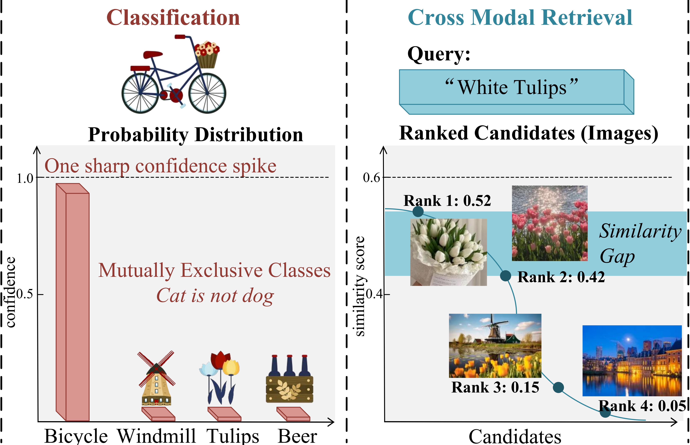

<div align="center">

# Unified Confidence Adjustment (UCA)

### Robust Cross-Modal Retrieval Under Test-Time Distribution Shifts

[]()
[]()
[]()
[]()

**Rui Zhou · Yawen Hao · Hao Zuo · Xinhang Wan · Cheng Zhu* · Yun Zhou***

National University of Defense Technology

</div>

---

> 🚀 Official implementation of **Unified Confidence Adjustment for Robust Cross-Modal Retrieval Under Test-Time Distribution Shifts (UAI 2026)**.

---

## 🔥 Highlights

### Why UCA?

Existing test-time adaptation methods mainly optimize entropy minimization:

```text
Low Entropy ≠ Correct Confidence
```

In cross-modal retrieval, blindly increasing confidence may:

❌ Over-sharpen similarity distributions

❌ Destroy semantic neighborhood structures

❌ Amplify retrieval errors

❌ Cause unstable adaptation

<p align="center">
  
</p>
---

## 🧠 Key Idea


Instead of maximizing confidence directly, UCA:

1. Identifies confidence states
2. Estimates source-like confidence margins
3. Adjusts confidence toward calibrated retrieval behavior
4. Preserves semantic neighborhood structures

---

## 📢 News

* **[2026.06.09]** UCA accepted by UAI 2026 🎉
* **[2026.06.02]** Code released.

---

## 📊 Benchmarks

### Natural Corruptions

| Dataset     | Image Corruptions | Text Corruptions |
| ----------- | ----------------- | ---------------- |
| Flickr30K-C | ✅                 | ✅                |
| MSCOCO-C    | ✅                 | ✅                |

---

### Zero-Shot Transfer

| Dataset     | Domain          |
| ----------- | --------------- |
| Flickr30K   | Natural Images  |
| MSCOCO      | Natural Images  |
| Fashion-Gen | E-Commerce      |
| Nocaps-ID   | Open-Vocabulary |
| Nocaps-ND   | Novel Domain    |
| Nocaps-OD   | Out-of-Domain   |

---

## 🏆 Performance

### Natural Corruption Robustness

| Dataset     | Backbone      | Avg. R@1 |
| ----------- | ------------- | -------- |
| Flickr30K-C | BLIP ViT-B/16 | **77.0** |
| MSCOCO-C    | BLIP ViT-B/16 | **60.8** |

---

### Zero-Shot Transfer

| Retrieval Task | Avg. R@1 |
| -------------- | -------- |
| Image → Text   | **69.8** |
| Text → Image   | **54.8** |

UCA consistently surpasses recent retrieval-TTA methods including:

* Tent
* SAR
* EATA
* DeYO
* READ
* TCR

---

## 📂 Repository Structure

```text
datasets
UCA
├── configs
├── methods
├── models
├── scripts
├── weights
├── output
└── main.py
```

---

## ⚙️ Installation

```bash
conda create -n uca python=3.8

conda activate uca

pip install -r requirements.txt
```

---

## 📦 Pretrained Models

Supported vision-language foundation models:

| Backbone      | Supported |
| ------------- | --------- |
| CLIP ViT-B/16 | ✅         |
| BLIP ViT-B/16 | ✅         |

Place checkpoints under:

```text
weights/
```

---

## 🚀 Quick Start

### Image-to-Text Retrieval

```bash
python main.py \
    --retrieval i2t \
    --method uca \
    --config configs/zeroshot/blip_flickr.yaml
```

### Text-to-Image Retrieval

```bash
python main.py \
    --retrieval t2i \
    --method uca \
    --config configs/zeroshot/blip_flickr.yaml
```

---


## 📖 Citation

```bibtex
waiting for publication~
```

---

## ❤️ Acknowledgements

This repository benefits from several excellent open-source projects:

* BLIP
* CLIP
* MM_Robustness
* READ
* TCR

Special thanks to the authors of:
[[](Code)](https://github.com/XLearning-SCU/2025-ICLR-TCR)


for releasing their code and benchmarks, which greatly facilitate research on test-time adaptation for cross-modal retrieval.

---

<div align="center">

⭐ If you find this repository useful, please consider giving it a star.

</div>
